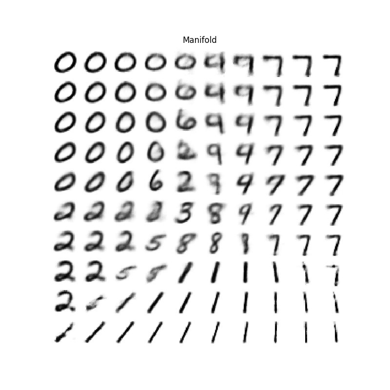

# Deep Learning

## Description

Code for the labs of the [Deep Learning](deeplearningamsterdam.github.io) course of the MSc in Artificial Intelligence at the University of Amsterdam.

### Lab 1 - Neural Networks, Convolutions and TensorFlow

We explore image classification with two neural network architectures: multi-layer perceptrons (MLP) and convolutional neural networks (CNN). We use the <a href="https://www.cs.toronto.edu/~kriz/cifar.html">CIFAR-10 dataset</a>, and experiment with various (hyper-) parameters for the MLP such as learning rate, weight initialization, activation functions, dropout, etc. For the CNN, we apply data augmentation and batch normalization. As expected, the CNN performs considerably better than the MLP.

#### Problems and Solutions
- [Main Problem statement](lab1/report/lab1_statement.md), [Python code](lab1) and [report](lab1/report/lab1_report.pdf)
- Pen-and-Paper [theoretical assignment](lab1/report/penpaper_statement.pdf) and [solutions](lab1/report/penpaper_solutions.pdf)

#### Known Issues
Due to a bug the Tensorflow MLP test results are largely inflated. The code has been fixed, and the report will be updated soon.

### Lab 2 - Recurrent Neural Networks

We explore the long-term dependency modelling capabilities of Recurrent Neural Networks (RNNs) and Long Short-Term Networks (LSTMs). Additionally, we train a character-level language model on natural language text and experiment with character-by-character text generation. Our initial experiment on a simple palindrome task indicate that, as expected, the LSTM is more capable of learning long-term dependencies than the vanilla RNN. To this end, we used a stacked LSTM network for the character-level language model.

#### Problems and Solutions
- [Main Problem statement](lab2/report/lab2_statement.md)
- [Report](lab2/report/lab2_report.pdf)
- [Python code](lab2)

#### Sample Results
The results below are generated by the two-layer stacked LSTM trained by truncated backpropagation-through-time with a sequence length of 30.

##### Decoded samples during training on a collection of works by Carl Sagan
| Training Step | First 30 Characters | More Characters |
|:-------------------------:|:-------------------------:|:-------------------------:|
| 0 | q,6N–e]Ü5“18>JS'qfeh;+*D*©C©J | - |
| 100 | Ze sugthage we clol sutes ute |  Ze sugthage we clol |
| 200 | ‘in capsionary It the moving 2 | 26, byfest on the marne of animent Fermar |
| 300 | ould beis. Thereece count of t | he lawsian are reall |
| 400 | I may to paracellions and in | time radio time.. Wou |
| 500 | moneasts are not the idea down |  too dead, but triliple |
| 1500 | You look wavellices in millions | of Triton than change from magnifications |

##### Sentence Completion
|Initial Sequence | Decoded Text|
|:-------------------------:|-------------------------|
|  theory of evolution | require to be compared within their states that there is nothing their cell can cross |
| Humans grew up in forests  | through the rule the pollen traces the seeds we have seen there has been variated animals |

### Lab 3 - Generative Models

We explore generative modelling with the naive bayes algorithm and variational inference on the MNIST dataset. The intractability issues that arise in generative modelling, specifically in the case of the naive bayes, are explored. We then use variational autoencoders on the same task and discuss how the intractability issues are resolved. We explore the performance of the naive bayes and variational autoencoder by sampling images from the models. 

#### Problems and Solutions
- [Report](lab3/report/lab3_report.pdf)
- [Python code](lab3)

#### Results

   
  <i>Manifold learned by the VAE</i>
   
   
   
  <i>Samples from the Naive Bayes model</i>

### Poster Presentations
We presented the [Weight Uncertainty in Neural Networks](https://arxiv.org/abs/1505.05424) paper by Blundell et al. This was done in collaboration with [Jose Gallego](https://github.com/jgalle29) and [Krsto Proroković](https://github.com/krstopro).

The poster can be found [here](poster_presentations/poster.pdf). The template for the poster was taken from [David Duvenaud's repository](https://github.com/duvenaud/deep-limits/).

### Dependencies
- Python 3.x: Tensorflow 1.4, SciPy, NumPy, Matplotlib

### Copyright

Copyright © 2017 Dana Kianfar.

This project is distributed under the <a href="LICENSE">MIT license</a>. Please follow the <a href="http://student.uva.nl/en/content/az/plagiarism-and-fraud/plagiarism-and-fraud.html">UvA regulations governing Fraud and Plagiarism</a> in case you are a student.

